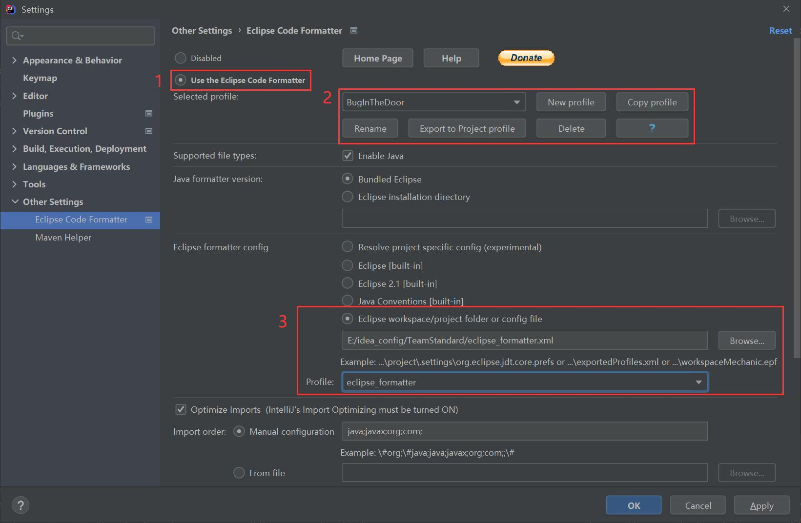
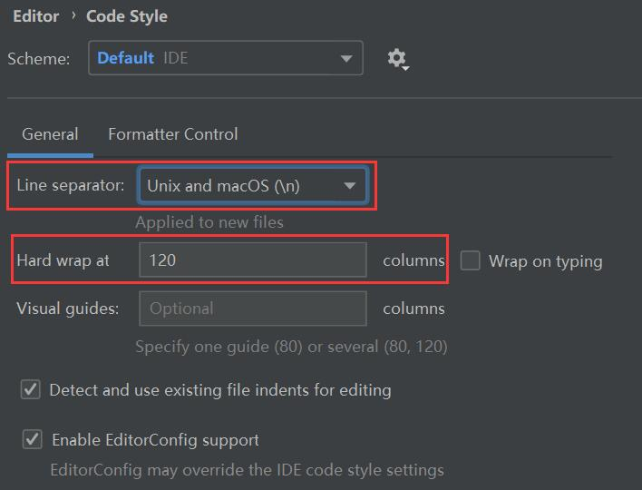
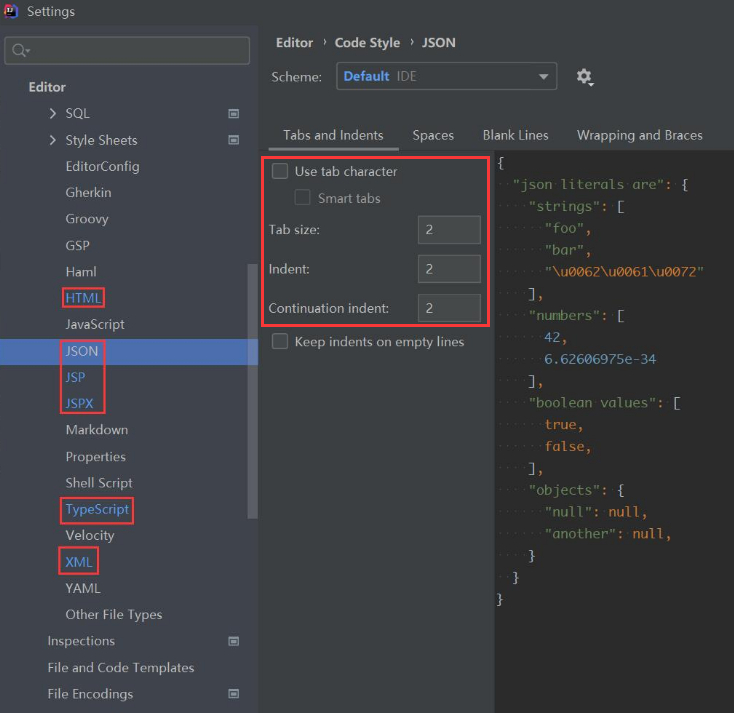
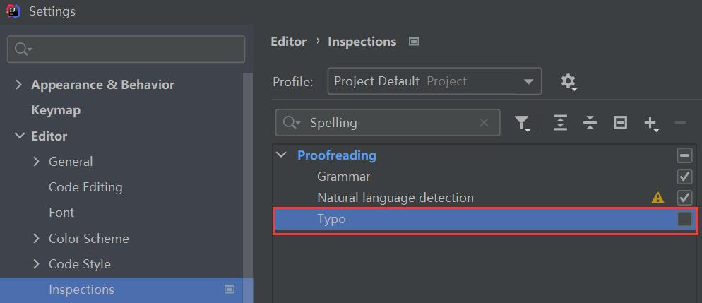
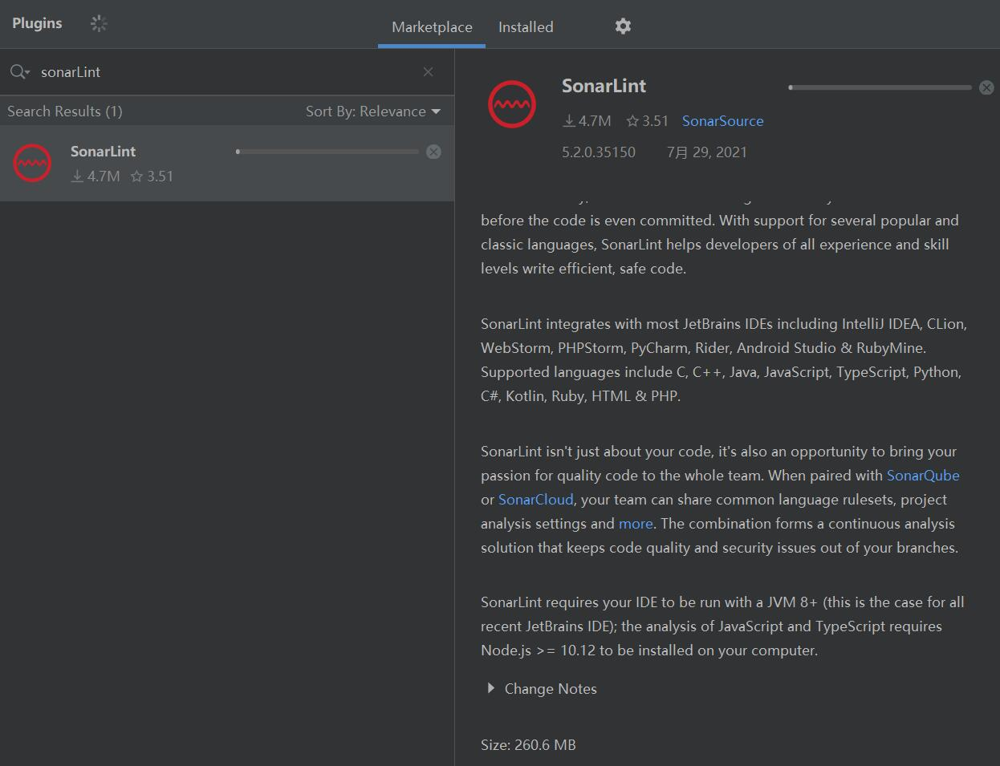
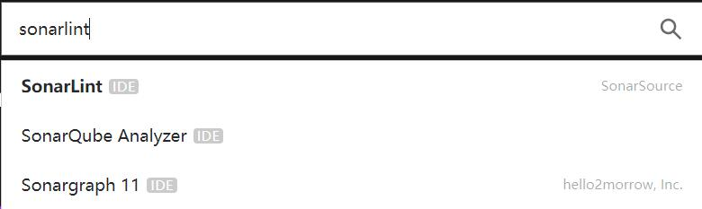
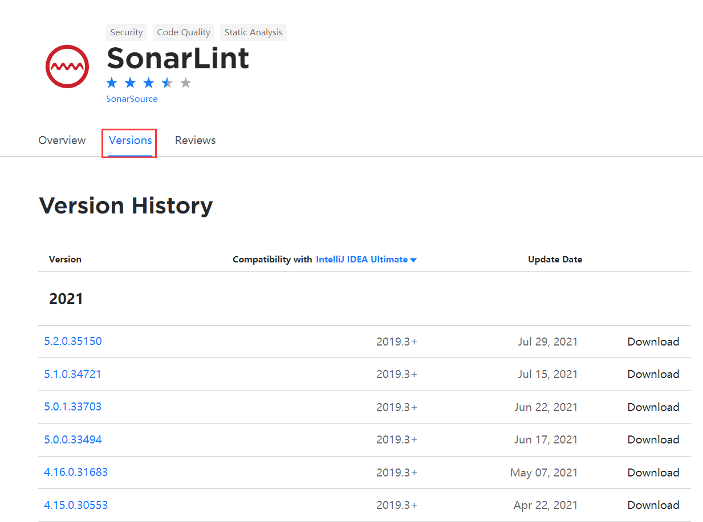
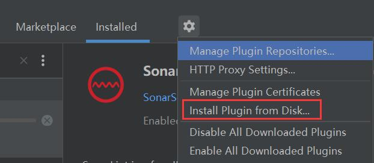

# Intellj 配置

编写目的: 保证产出的代码一致性，提高代码输出、查阅、定位的效率。

下文中提供所有设置要求将分为以下几种类型，根据不同类型请进行选择进行相应操作:

1.【强制】: 项目组内必须统一进行设置，不允许有个性化设置 2.【建议】: 文档编写者根据经验建议设置，开发人员可以根据自己的使用习惯选择是否设置

## 2. 代码规范

### 2.1. 【强制】所有代码文件必须采用 UTF-8 格式编码

Settings -> Editor -> File Encodings -> Global Encoding -> `UTF-8`
Settings -> Editor -> File Encodings -> Project Encoding -> `UTF-8`
Settings -> Editor -> File Encodings -> Properties Files(\*.properties) -> Default encoding for properties files -> `UTF-8`

### 2.2. 【强制】代码格式化

1. 下载 **Eclipse Code Formatter** 插件

   Settings -> Plugins -> 搜索 `Eclipse Code Formatter` 并安装

2. 导入 **eclipse_formatter.xml** 文件

   Settings -> Other Settings -> Eclipse Code Formatter -> 勾选 `Use the Eclipse Code Formatter`

   

### 2.3. 【强制】IDE 显示设置

Settings -> Editor -> Code Style:

#### 2.3.1. 设置换行符为 `\n` 以及每行边界为 `120`

#### 2.3.2. 设置 HTML, JSON, JSP, JSPX, TS, XML 缩进

- 不使用 tab
- Tab 大小为 2
- 行缩进为 2
- 持续行缩进为 2

## 3. 提升开发效率

### 3.1. 【强制】显示**空白格**

Settings -> Editor -> General -> Appearance -> `Show whitespaces`

### 3.2. 【建议】开启 Postfix Completion

> - [Postfix Completion 使用说明](https://www.jetbrains.com/help/idea/settings-postfix-completion.html)
> - [自定义 Postfix Completion](https://www.jetbrains.com/help/idea/auto-completing-code.html)

Settings -> Editor -> General -> Postfix Completion -> `Enable postfix completion`

### 3.3. 【建议】关闭拼写检查

建议关闭拼写检查以提升 IDE 运行效率

Settings -> Editor -> Inspections -> 搜索 Spelling -> 取消勾选 `Typo`

## 4. 安装插件

### 4.1. 【强制】安装 SonarLint

#### 4.1.1. 通过 Plugins 安装

Settings -> Plugins -> 搜索 `SonarLint` 并安装

#### 4.1.2. 通过本地磁盘安装

SonarLint 插件有 260 MB+，如果网络不好安装失败可以通过本地安装的方式

打开[Intellj IDEA 官方插件网站](https://plugins.jetbrains.com/idea) 搜索 **SonarLint**

点击 **Versions** 并自行下载某版本

下载完成后，通过 Plugins 里的 `Intall Plugin from Disk` 安装

